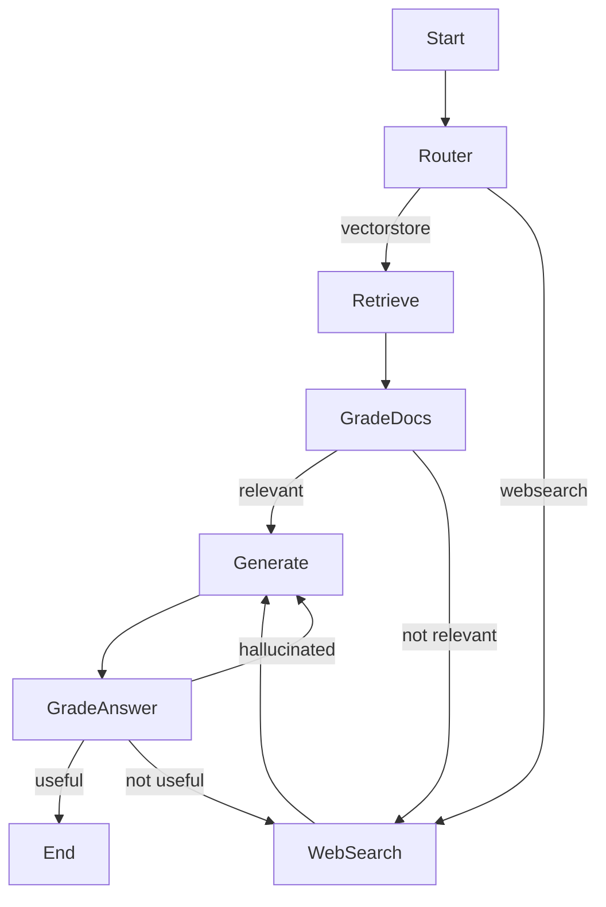

# 🔁 Adaptive-Corrective-Self-RAG (LangGraph-Powered)

A modular, multi-stage Retrieval-Augmented Generation (RAG) pipeline built using **LangGraph**.  
This project introduces **adaptive routing**, **hallucination grading**, and **automated self-correction**, enabling robust and reliable question answering over vector-based and web data sources.

---

## 🚀 Features

- ✅ **LangGraph Workflow** with conditional and looping logic  
- 📄 **RAG Node** powered by vector search and LLM generation  
- 🌐 **Web Search Node** as fallback when internal docs are insufficient  
- 🧠 **LLM-based Graders** for:  
  - Relevance of retrieved chunks  
  - Hallucination detection  
  - Answer usefulness  
- 🔄 **Retry Loops** for hallucinated generations  
- 🧪 **Unit Tested** grading logic using `pytest`  

---

## 🧠 Architecture

📁 Project Structure
Advanced_RAG/  
├── main.py                 # Entry point to run the workflow  
├── ingestion.py            # Vector DB creation & retriever object  
├── .env                    # API keys (GROQ_API_KEY)  
├── .gitignore              # Ignores .env, pycache, etc.  
  
graph/  
├── graph1.py               # Builds and compiles LangGraph workflow  
├── consts.py               # Constants like RETRIEVE, GENERATE  
├── state.py                # Defines the GraphState TypedDict  
  
graph/nodes/                # LangGraph nodes  
├── retrieve.py             # Retrieves documents from vector store  
├── generate.py             # Generates answer using LLM  
├── grader.py               # Grades doc relevance  
├── web_search.py           # Tool for external search  
   
graph/chains/               # LangChain Runnables and chains  
├── generation.py           # Prompt + LLM + parser  
├── answer_grader.py        # Grades if answer addresses question  
├── hallucination_grader.py # Checks grounding in context  
├── router.py               # Classifies query source (web vs vector)  
├── tests/test_chains.py    # Unit tests for grading logic  

